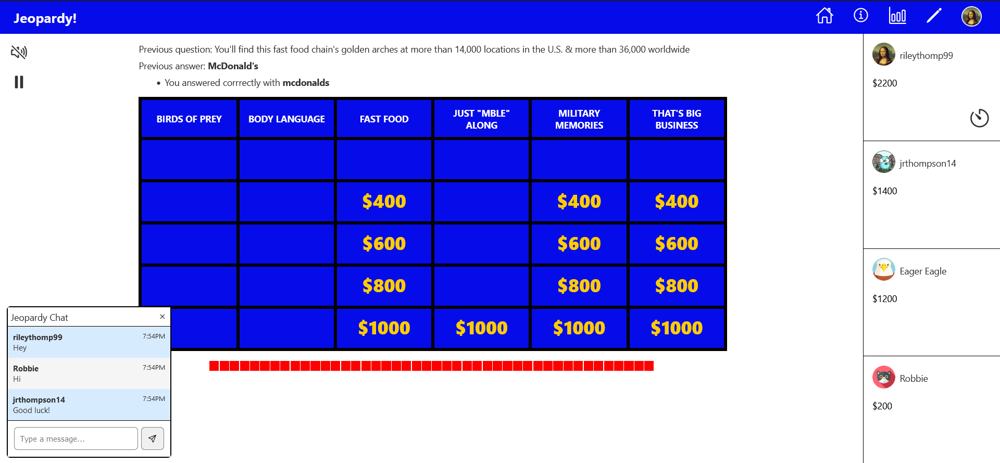
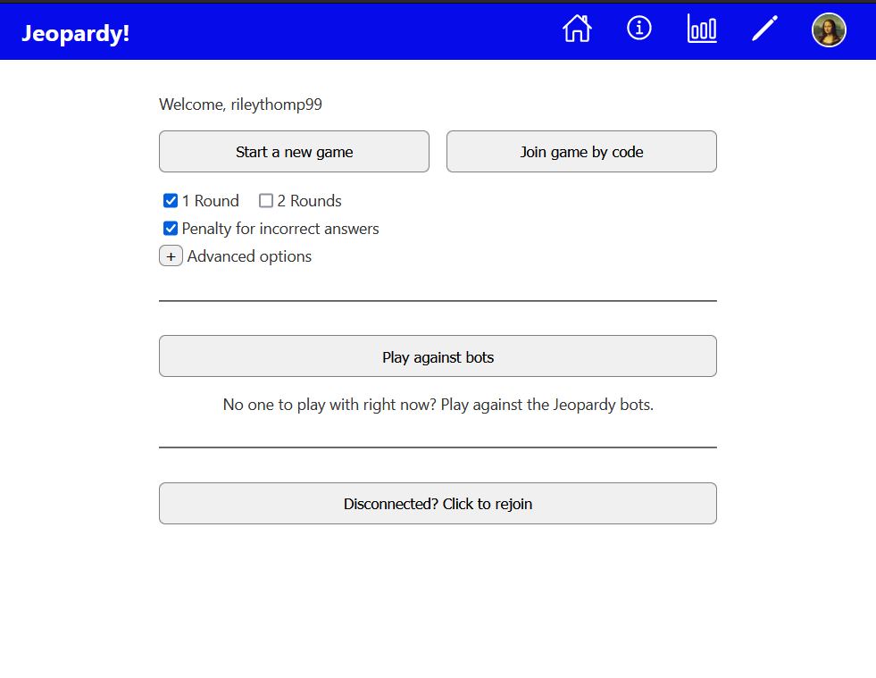

# Jeopardy

Real-time multi-player Jeopardy game with over 100,000 questions.

Play here: https://playjeopardy.netlify.app

<details>
  <summary>Screenshots</summary>



<details>
  <summary>Home page</summary>



</details>

<details>
  <summary>Search page</summary>
  


</details>

<details>
  <summary>Config page</summary>
  


</details>

<details>
  <summary>Analytics page</summary>
  


</details>

</details>

### Features

- Sign in with Google and GitHub accounts or email

- Game configuration

  - Choose the categories you want to play with
  - Play against other people or against bots
  - Play solo or with up to 6 players
  - Play 1 or 2 round games
  - Play with or without penalties for incorrect answers
  - Play in public or private games

- Game analytics

  - Total number of games played
  - Average score after each round
  - Buzz-in rate for each round
  - Correctness rate for each round

- In-game chat

- Allows for players to pause the game

- Handles players disconnecting and rejoining the game

### Development

Server

```
$ cd jeopardy-be
$ go mod tidy
$ docker compose up -d postgres
$ source .env
$ make run
```

Client

```
$ cd jeopardy-fe
$ npm install
$ ng serve
```

### TODO

- Accounts with user stats

- Leaderboards

- Allow players to select bot difficulty

- Tournament play

- Support teams

- Allow players to import their own questions

- Look into pion for voice chat
